# 📚 Gravity Books — Data Warehouse Project

A full end-to-end Data Warehouse solution for a fictional bookstore chain, **Gravity Books**, built as the Final Project of ITI DWH course . The project covers dimensional modeling, ETL pipelines using SSIS, OLAP cube design using SSAS, and business intelligence reporting using Power BI.

---

## 📁 Project Structure

```
SSIS_Gravity_books/          # SSIS ETL solution
SSAS_Gravity_books/           # SSAS OLAP cube solution
dwh.pbix                    # Power BI dashboard 
README file
```

---

## 🗄️ Data Warehouse Architecture

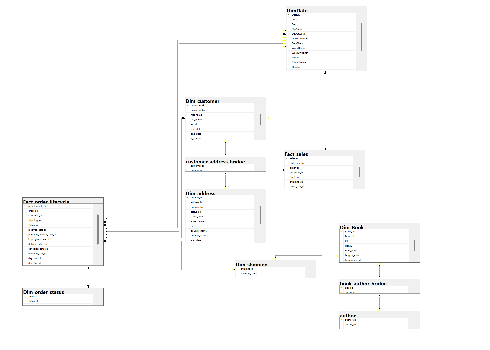

The DWH is built using a **Galaxy Schema** with the following tables:

### Dimension Tables

| Table | Description  | Row Count |
|---|---|---|
| `Dim_book` | Book information (title, language, publisher) | 11,127 |
| `Dim_author` | Author details  | 9,235 |
| `Dim_book_author_bridge` | Many-to-many bridge between books and authors | Bridge | 17,642 |
| `Dim_customer` | Customer information  | 2,000 |
| `Dim_address` | Address details with SCD Type 2  | 3,350 |
| `Dim_cust_address_bridge` | Bridge between customers and addresses | Bridge | 3,350 |
| `Dim_order_status` | Order status lookup  | 4 rows |
| `Dim_shipping` | Shipping method lookup | 6 rows |
| `Dim_date` | Date dimension | — |

### Fact Tables

| Table | Description | Row Count |
|---|---|---|
| `Fact_order_Sales` | Sales transactions with revenue, shipping FK, book FK, customer FK | 15,400 |
| `Fact_order_lifecycle` | Order lifecycle events with multiple date FKs (pending, in-progress, delivered, cancelled, returned) | 7,544 |

---

## 🔄 ETL Pipeline (SSIS)

The ETL solution is built in **SQL Server Integration Services (SSIS)** and handles full loads and Slowly Changing Dimensions (SCD).

### Dimension ETL Flows

**`Dim_book`**
- Source → Data Conversion → `Dim_book` destination
- 11,127 rows loaded
  
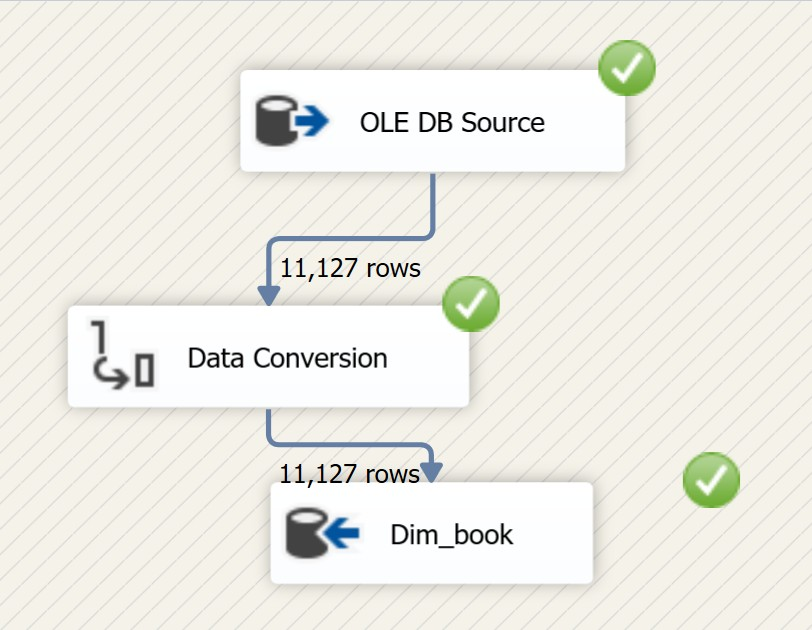

**`Dim_author`**
- Source → Data Conversion → `Dim_author` destination
- 9,235 rows loaded (includes 5 rows via separate data conversion path)
  
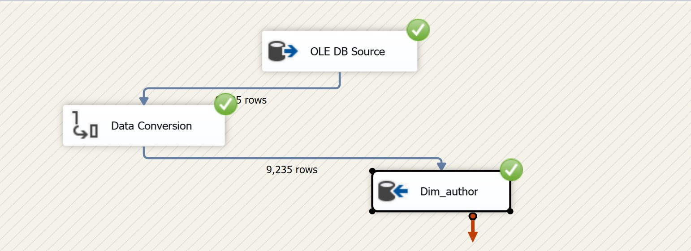

**`Dim_book_author_bridge`**
- OLE DB Source → `Lookup_on_dimBook` → `Lookup_on_dimAuthor` → `Dim_book_author_bridge`
- 17,642 rows loaded
  
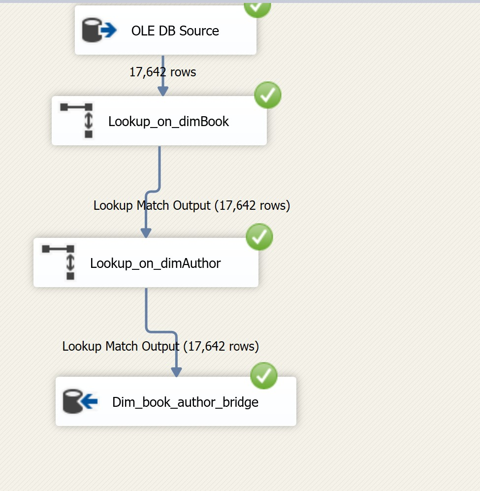

**`Dim_address`** *(SCD Type 2)*
- Source → SSC transform → Slowly Changing Dimension wizard
- Historical Attribute Inserts → Derived Column → OLE DB Command (expire old record)
- New Output → Union All → `is_Current` / `st_Date` derived column → `Dim_Address`
- 3,350 rows

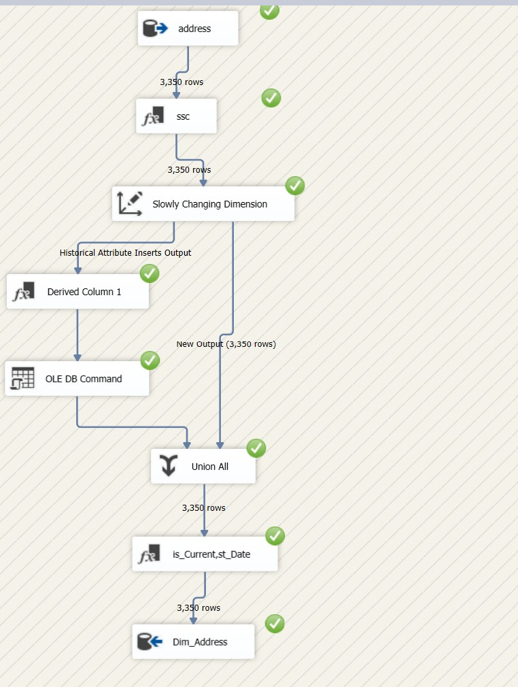

**`Dim_customer`** *(SCD Type 2)*
- Source → Data Conversion → SSC → Slowly Changing Dimension
- Historical Attribute Inserts → Derived Column → OLE DB Command
- Changing Attribute Updates → OLE DB Command 1
- Union All → Derived Column 1 → Insert Destination
- 2,000 rows
  
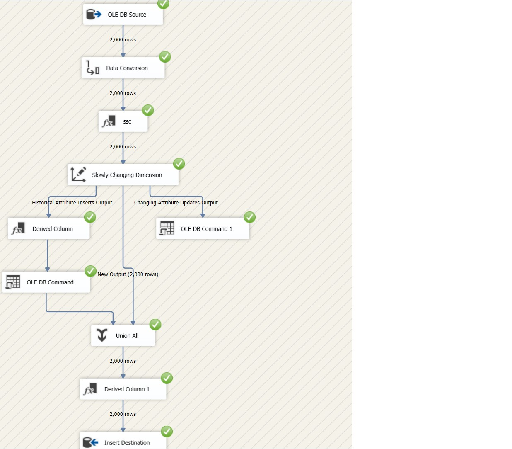

**`Dim_cust_address_bridge`**
- OLE DB Source → `customer_lookup` → `address_lookup` → `Dim_cust_address_bridge`
- 3,350 rows
- 
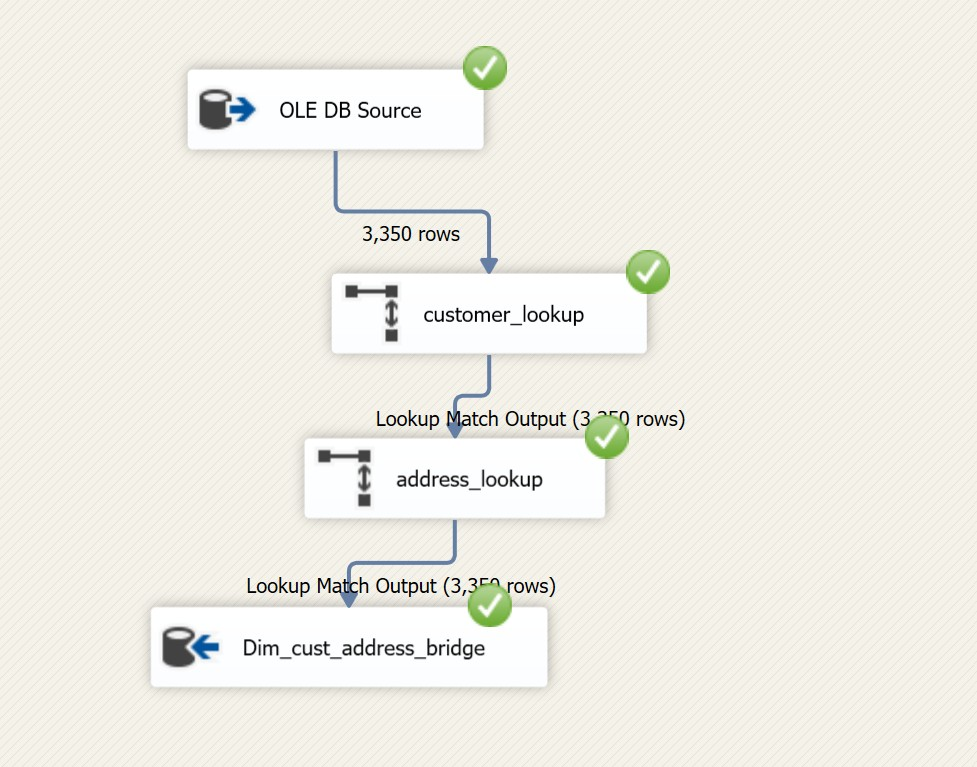

**`Dim_order_status`**
- OLE DB Source → OLE DB Destination
- 6 rows
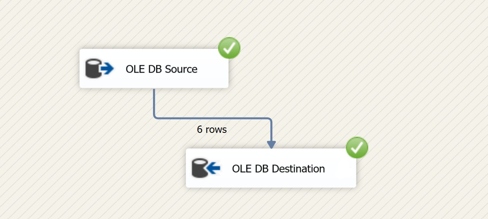

**`Dim_shipping`**
- OLE DB Source → OLE DB Destination
- 4 rows

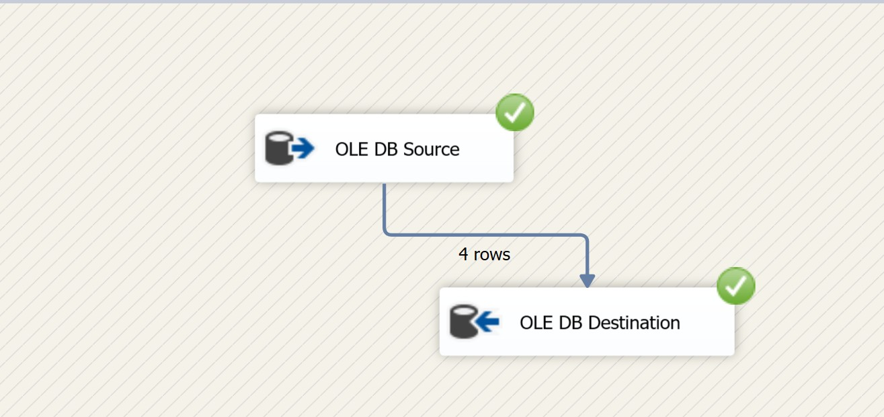

### Fact ETL Flows

**`Fact_order_Sales`**
- `Source_sales` (15,400 rows)
- → `convert_orderDate` to DT_DBTIMESTAMP
- → `Lookup_dim_date` → `lookup_customer` → `lookup_book` → `lookup_shipping_method`
- → `Fact_sales` destination

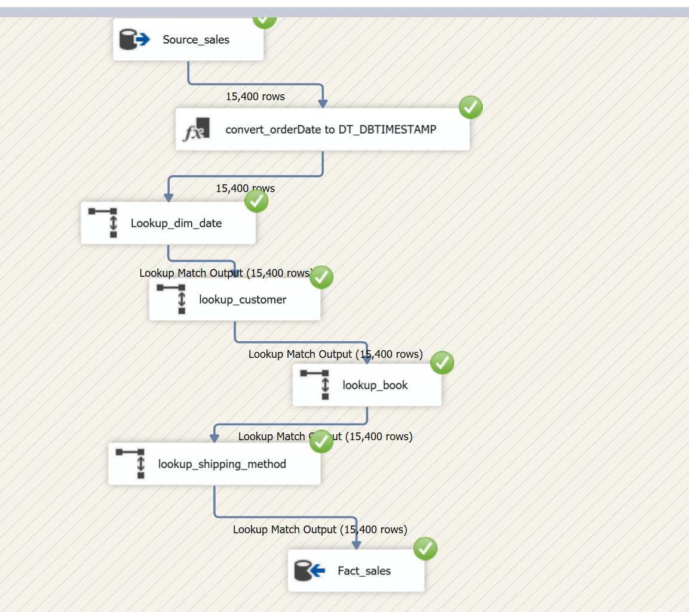

**`Fact_order_lifecycle`**
- `Source_order_lifecycle_joins` (7,544 rows)
- → Date conversion → `is_complete` / `is_cancelled` derived columns
- → Lookups: `dim_receive_date`, `dim_pend_date`, `dim_inprogress_date`, `dim_deliver_date`, `dim_cancel_date`, `dim_returned_date`
- → `lookup_customer` → `lookup_shipping_method` → `lookup_order_status`
- → `Fact_order_lifecycle` destination

  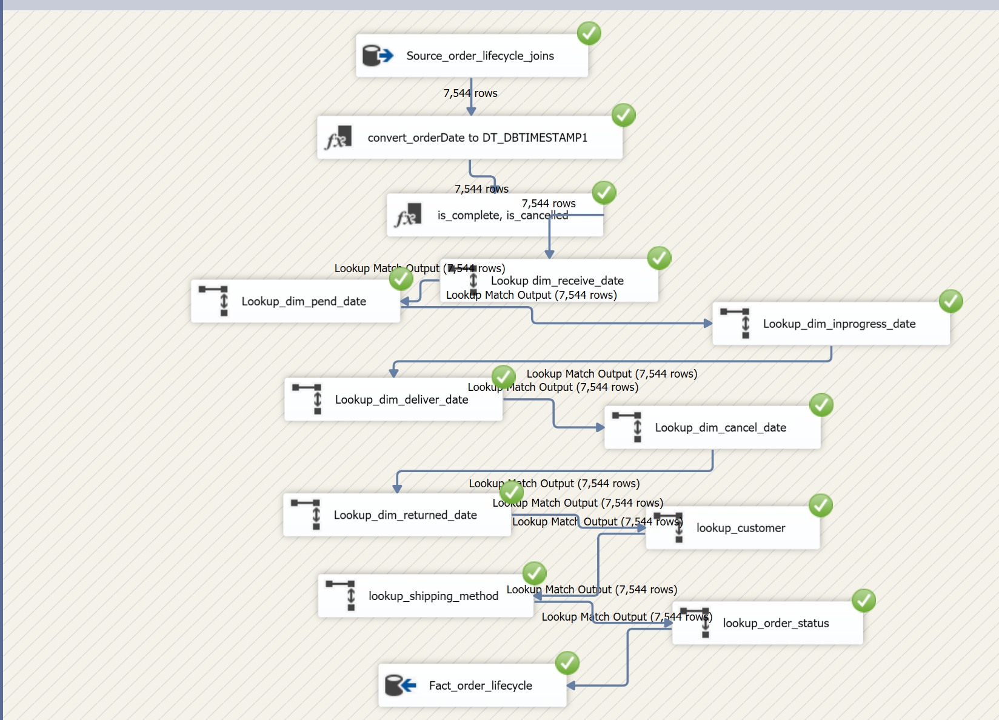

---

## 🧊 OLAP Cube (SSAS)

The `gravity_iti_cube` solution builds a multidimensional OLAP cube on top of the DWH using **SQL Server Analysis Services (SSAS)**, enabling slice-and-dice analysis across dimensions such as books, authors, customers, time, and shipping methods.


  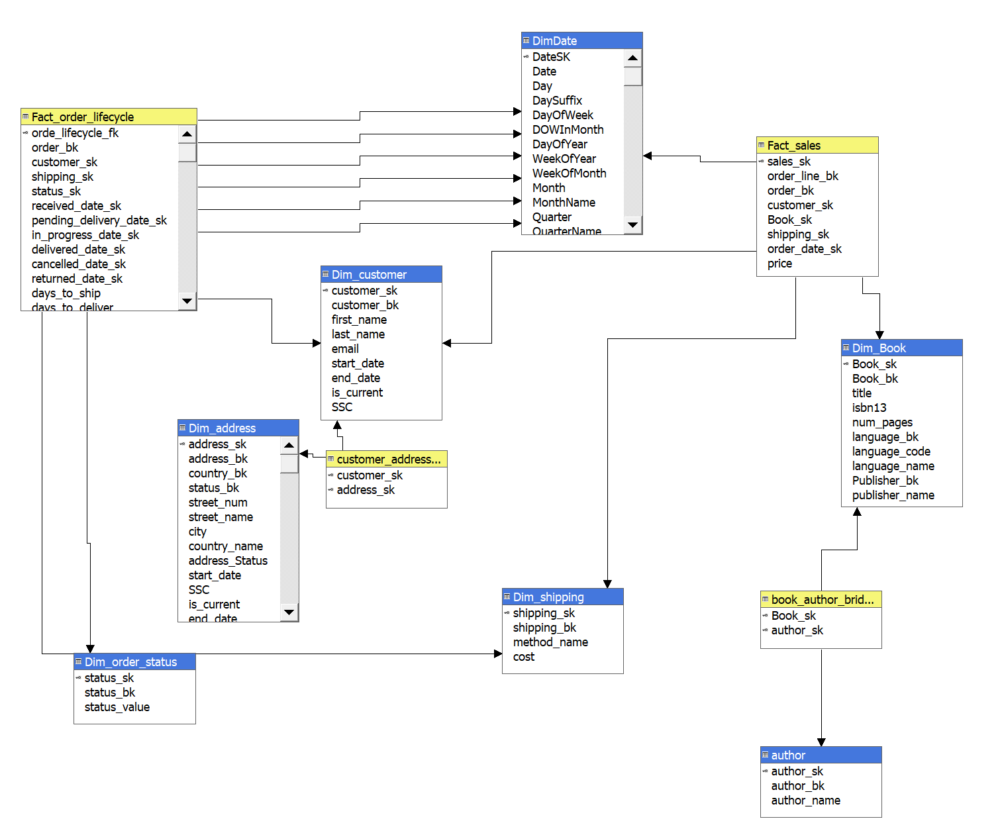
  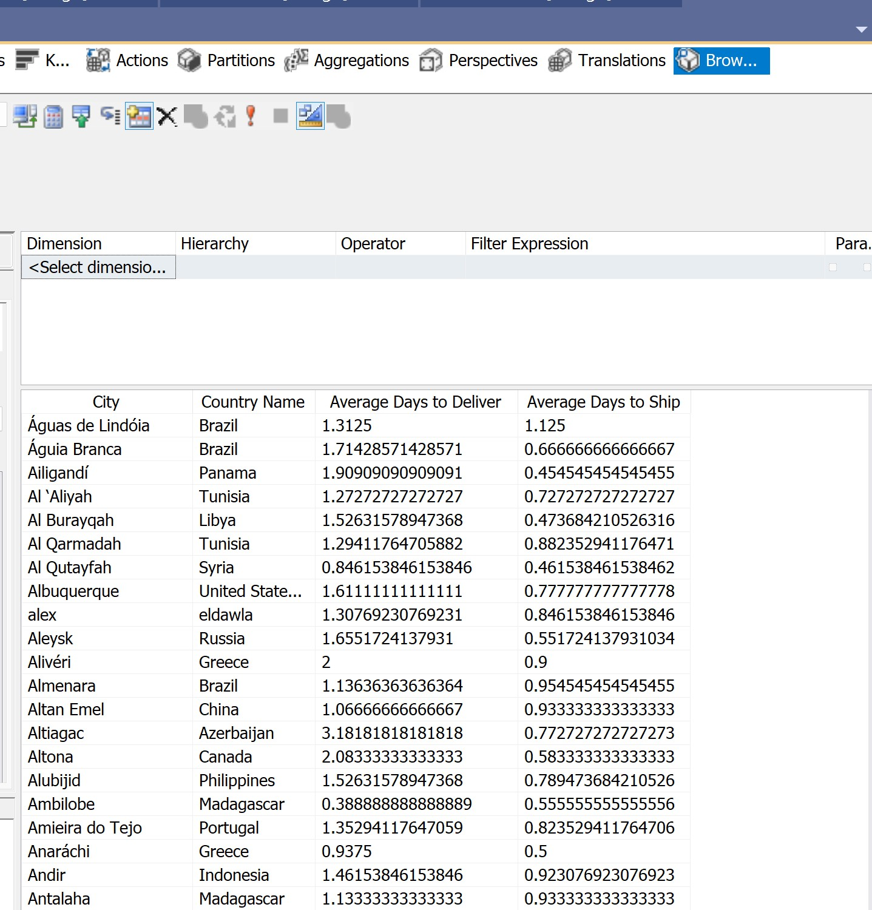
---

## 📊 Power BI Dashboard

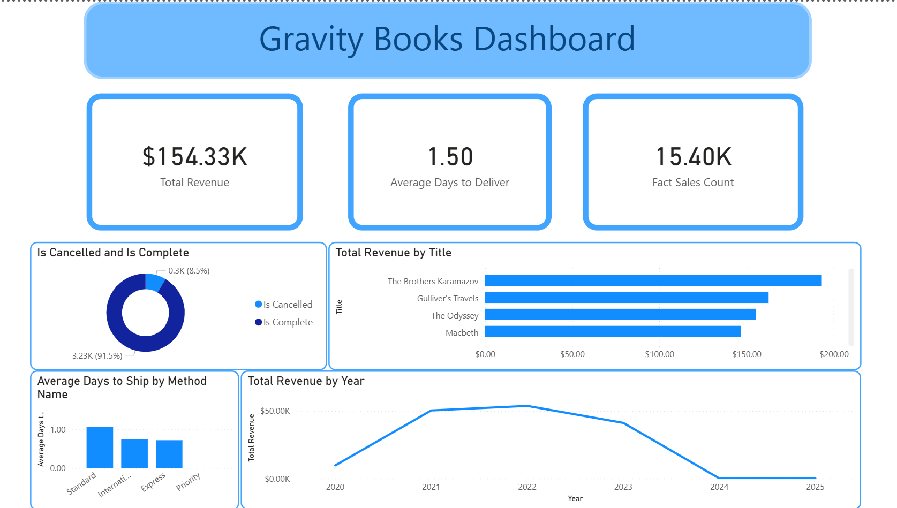


The `dwh.pbix` file contains a **Gravity Books Dashboard** with the following visuals:

### KPI Cards
- **Total Revenue**: $154.33K
- **Average Days to Deliver**: 1.50
- **Fact Sales Count**: 15.40K

### Charts
- **Is Cancelled vs Is Complete** (Donut chart): 91.5% complete, 8.5% cancelled
- **Total Revenue by Book Title** (Bar chart): Top sellers include *The Brothers Karamazov*, *Gulliver's Travels*, *The Odyssey*, and *Macbeth*
- **Average Days to Ship by Method** (Bar chart): Comparing Standard, International, Express, and Priority shipping
- **Total Revenue by Year** (Line chart): Peak revenue in 2022, declining through 2025

---

## 🛠️ Technologies Used

| Tool | Purpose |
|---|---|
| SQL Server | Source OLTP database & DWH staging |
| SSIS | ETL pipelines |
| SSAS | OLAP cube (multidimensional model) |
| Power BI | Business intelligence dashboards |
| Visual Studio | SSIS & SSAS project development |

---

## 🚀 Getting Started

### Prerequisites
- SQL Server 2019+ with Integration Services and Analysis Services
- Visual Studio with SSDT (SQL Server Data Tools)
- Power BI Desktop

### Steps

1. **Restore the source database** — Set up the `gravity_books` OLTP database on your SQL Server instance.
2. **Create the DWH database** — Run the DWH schema scripts to create all dimension and fact tables.
3. **Run the SSIS solution** — Open `Gravity_Books_ITI.sln` in Visual Studio and execute the packages in this order:
   - Dimension packages first (Dim_date, Dim_book, Dim_author, Dim_customer, Dim_address, Dim_shipping, Dim_order_status)
   - Bridge tables next (Dim_book_author_bridge, Dim_cust_address_bridge)
   - Fact tables last (Fact_order_Sales, Fact_order_lifecycle)
4. **Deploy the SSAS cube** — Open `gravity_iti_cube.sln` and deploy/process the cube.
5. **Open the Power BI report** — Open `dwh.pbix` and refresh the data source connection to point to your DWH.

---

## 👤 Project

**ITI Data Warehouse final project**
